# Using the eRecord app { #capture_app } 

## About the eRecord app { #about_capture_app } 

eRecord is a localized and enhanced version of the DHIS2 Capture system used in Nepal. It is part of the efforts to improve health information systems in the country. Specifically, eRecord is designed to manage and track individual-level data, such as patient records, events, cases, allowing for detailed follow-up and monitoring over time.

1. Individual Tracking: eRecord enables the tracking of individual entities (e.g., patients) over time. This is useful for programs that require longitudinal data, such as maternal health or immunization programs.

2. Event Registration: In eRecord, events (such as health visits, vaccinations, or diagnoses) are registered with specific details, including the date, location, and related data. These events are linked to individual entities.

3. Organization Unit and Program Selection: Users can select the relevant organization unit (such as a health facility) and program before entering event data. This ensures that the data is correctly categorized and organized.

4. Integration with DHIS2: eRecord is integrated within the DHIS2 platform, benefiting from the robust data management and reporting capabilities that DHIS2 offers. This includes the ability to generate reports, analyze data, and use dashboards for decision-making.

5. Localized for Nepal: eRecord has been customized to meet the specific needs and contexts of Nepal, including support for the Nepali calendar and other local requirements.

## Register an event { #capture_register_event } 

1. Open the **eRecord** app.

2. Select an organisation unit.

3. Select an event program.

    You will only see programs associated with the selected organisation unit and programs you have access to, and that are shared with your user group through data level sharing.

4. If the program has a category combination set the category option will have to be selected.

5. Click **Create new event**.

    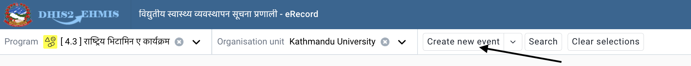

6. Fill in the required information. If the programs program stage is configured to capture a location:

    - If the field is a coordinate field you can either enter the coordinates
    directly or you can click the **map** icon to the left of the coordinate field.
    The latter one will open a map where you can search for a location or set on
    directly by clicking on the map.

    - If the field is a polygon field you can click the **map** icon to the left of
    the field. This will open a map where you can search for a location and capture
    a polygon (button in the upper right corner of the map).

7. If desired, you can add a note by clicking the **Write note** button at the bottom of the form. Be aware that Event notes are attributed to a user and cannot be deleted. 

8. If desired you can add a relationship by clicking the **Add relationship** button at the bottom of the form.
   See the section about **Adding a relationship** for more information.

9. Click **Save and exit** or click the arrow next to the button to select **Save and add another**.

    - **Save and add another** will save the current event and clear the form.
    All the events that you have captured will be displayed in a list at the bottom of the page.
    When you want to finish capturing events you can, if the form is blank,
    click the finish button or if your form contains data click the arrow
    next to **Save and add another** and select **Save and exit**.

    

> **Note**
>
> Some data elements in an event might be mandatory (marked with a red star next to the data element label).
> All mandatory data elements must be filled in before the user is allowed to complete the event.
> The exception to this is if the user has the authority called __"Ignore validation of required fields in Tracker and Event Capture".__
> If the user has this authority, the mandatory data elements will not be required and
> the red star will not be displayed next to the data element label. Note that super user that have the __"ALL"__ authority automatically
> have this authority.

> **Tip**
>
> The data entry form can also be displayed in **row view**. In this mode the data elements are arranged horizontally. This can be
> achieved by clicking the **Switch to row view** button on the top right of the data entry form. If you are currently in **row view** you
> can switch to the default form view by clicking the **Switch to form view** button on the top right of the data entry form.

## Register a tracked entity instance

There are two different ways one can register a tracked entity instance under an organisation unit.
The first way, is to register a tracked entity instance without enrolling it to a tracker program.
The second option, is to register a tracked entity instance with program and enroll it. 

### Without a program enrollment 

1. Open the **eRecord** app.

2. Select an organisation unit.

3. Click **Create new**.

    You'll now be navigated to the registration page. In that page you will see a drop down 
    menu similar to the one in the image below. From the dropdown menu you can select a tracked entity 
    type, eg. Building, Person etc.
    
    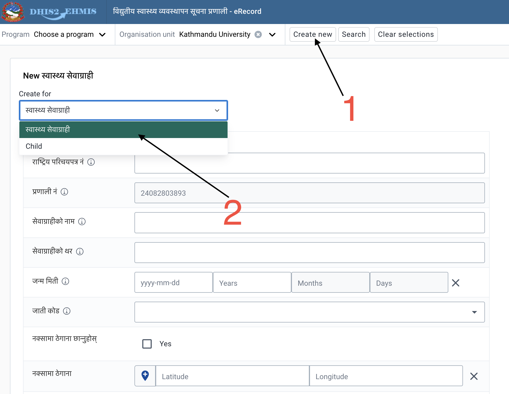

4. Select the tracked entity type which you want to create a new instance for.
     
5. The moment you select a tracked entity type, a form will be shown on the screen. 
    
    The "Profile" section will be shown. In this section you can add data relevant to the 
    tracked entity instance. The profile section mainly contains all the tracked entity attributes
    linked to the tracked entity type. 

6. Fill in the required information.

    If the tracked entity type is configured to capture a location:

    - If the field is a coordinate field you can either enter the coordinates
    directly or you can click the **map** icon to the left of the coordinate field.
    The latter one will open a map where you can search for a location or set on
    directly by clicking on the map.

    - If the field is a polygon field you can click the **map** icon to the left of
    the field. This will open a map where you can search for a location and capture
    a polygon (button in the upper right corner of the map).

7. Click the **Save person** button to register the tracked entity instance. 
    
8. You will now be prompted to the tracked entity instance dashboard. 

    The dashboard will show relevant information about the newly created tracked entity instance.

### With a program enrollment

1. Open the **eRecord** app.

2. Select an organisation unit.

3. Select a tracker program of your choice.

4. Click **Create new person**. Note that the label of this button corresponds to the tracked entity type of the program, which could vary, such as "Building," "Person," etc.

    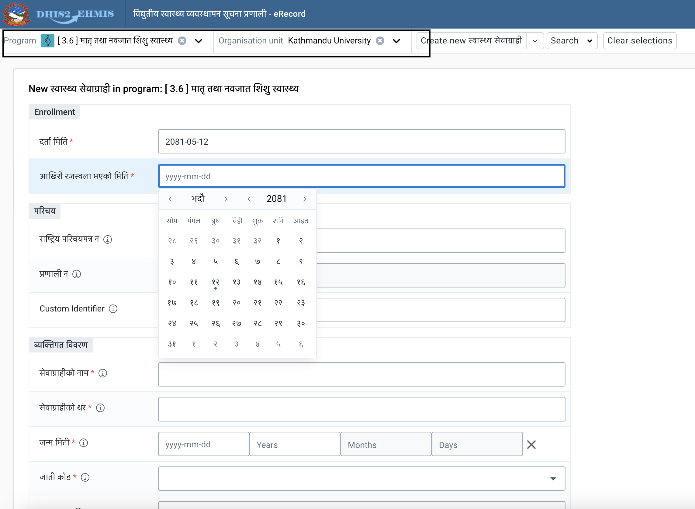
 
5. Now, you will be able to see a form similar to the image below. 

    The enrollment form has different layouts depending on how the program is customized. The top section has the title "Enrollment",
    and it holds all the relevant information about the enrollment details. This section will always be present, regardless of layout.
    Underneath, the different data input fields relevant to the tracked entity instance will be displayed. 
    These fields will either be displayed within sections or as a completely custom form. 
    The sections, or custom form, mainly contains all the tracked entity attributes linked to the program or tracked entity type.

6. Fill in the required information for the enrollment.
    If the tracked entity type is configured to capture a location:

    - If the field is a coordinate field you can either enter the coordinates
    directly or you can click the **map** icon to the left of the coordinate field.
    The latter one will open a map where you can search for a location or set on
    directly by clicking on the map.

    - If the field is a polygon field you can click the **map** icon to the left of
    the field. This will open a map where you can search for a location and capture
    a polygon (button in the upper right corner of the map).

7. Click **Save person** to register the tracked entity instance. 
    The **Save** button shows a loading spinner and the **Cancel** button is disabled while the request is processing.
    
8. You will now be prompted to the tracked entity instance dashboard. 

    The dashboard will show relevant information about the newly created tracked entity instance.

> **Note**
>
> Some data elements in an event might be mandatory (marked with a red star next to the data element label).
> All mandatory data elements must be filled in before the user is allowed to complete the event.
> The exception to this is if the user has the authority called __"Ignore validation of required fields in Tracker and Event Capture".__
> If the user has this authority, the mandatory data elements will not be required and
> the red star will not be displayed next to the data element label. Note that super user that have the __"ALL"__ authority automatically
> have this authority.

> **Tip**
>
> The data entry form can also be displayed in **row view**. In this mode the data elements are arranged horizontally. This can be
> achieved by clicking the **Switch to row view** button on the top right of the data entry form. If you are currently in **row view** you
> can switch to the default form view by clicking the **Switch to form view** button on the top right of the data entry form.

### Possible duplicates detection

In both cases of registering a tracked entity instance, (with enrollment or without enrollment) the system will start looking for possible duplicates.
Note that programs need to be correctly configured through the maintenance app for the system to start detecting duplicates when enrolling a new person in a program. 

Let us explain this with an example that demonstrates the detection of possible duplicates while enrolling a child in the Child Programme. 

1. Open the **eRecord** app.

2. Select your organisation unit and program from the menu on the top.

3. Click **Create new person**

4. Fill in the first name in the form. **Remember, the first name we have checked as "Searchable" in the maintenance app.** 
Click **Save person**. The system will start looking for possible duplicates that match the name Sarah.
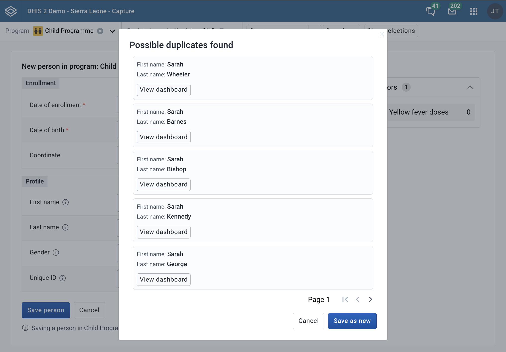

5. The system will automatically show a list of possible duplicates if there are any. 

6. You can choose to make a new enrollement by clicking **Save as new** or if you see the right person in the list - you can view the dashboard.

> **Tip**
>
> You can configure duplicates detection for tracked entity types the same way as we did for programs. 

### Program rules execution

In both cases of registering a tracked entity instance (with enrollment or without enrollment), the system will run program rules you have configured.
Note that rules can be configured in the maintenance app.

To see a rule being executed while enrolling a tracked entity instance you will have to take the following steps. 

1. Configure a rule in the maintenance app. For the example below we configured a rule that throws a warning when the date of birth is less than a year.

2. Open the **eRecord** app.

3. Select your organisation unit and program from the menu on the top.

4. Fill in the date of birth with a value which is less than a year. In our case this is 04 of Shrawan 2082. 

5. You will now be able to see the warning produced by the program rule underneath the birth date field. 

## Edit an event { #capture_edit_event } 

1. Open the **eRecord** app.

2. Select a program.

3. Select an organisation unit or click the _all events_-link to view all events accessible to you.

    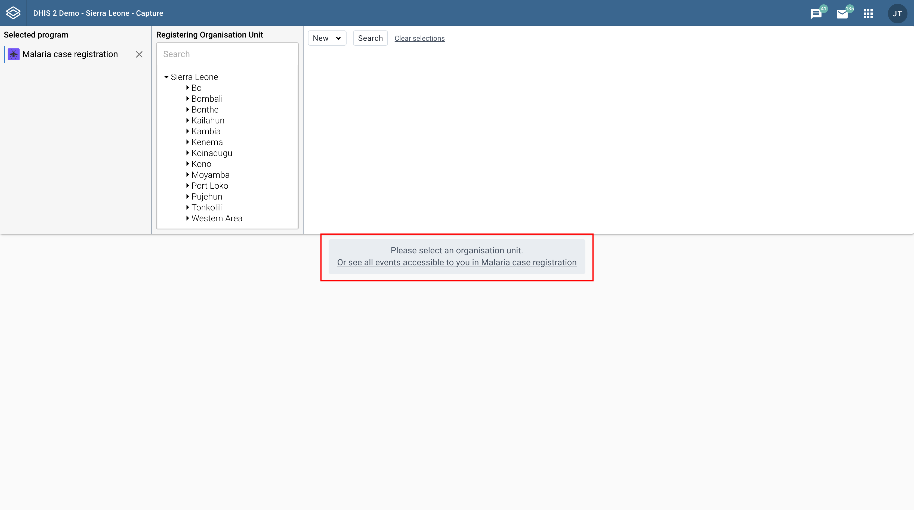
    All events registered to the selected program show up in a list.

4. Click the event you want to modify.

5. Click the **Edit event** button.

6. Modify the event details and click **Save**.

## Delete an event { #capture_delete_event } 

1. Open the **eRecord** app.

2. Select an organisation unit.

3. Select a program.

    All events registered to the selected program show up in a list.

4. Click the **triple dot** icon on the event you want to delete.

5. In the menu that is displayed click **Delete event**.

    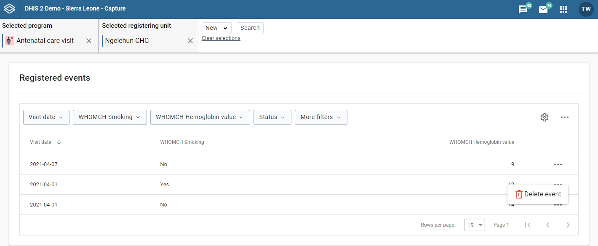

## Modify an event list layout { #capture_modify_event_list_layout } 

You can select which columns to show or hide in an event list. This can
be useful for example when you have a long list of data elements
assigned to a program stage.

1. Open the **eRecord** app.

2. Select an organisation unit.

3. Select a program.

    All events registered to the selected program show up in a list.

4. Click the **gear** icon on the top right of the event list.

5. Select the columns you want to display and click **Save**.

    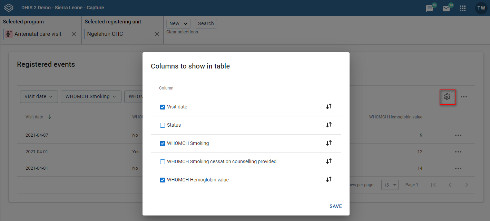

> **Tip**
>
> You can reorganize the order of the data elements by draging and dropping them in the list.

## Filter an event list { #capture_filter_event_list } 

1. Open the **eRecord** app.

2. Select an organisation unit.

3. Select a program.

    All events registered to the selected program show up in a list.

    Along the top of the event list are buttons with the same names as the column headers in the list.

4. Use the buttons on the top of the list to filter based on a report date or a specific data element.

    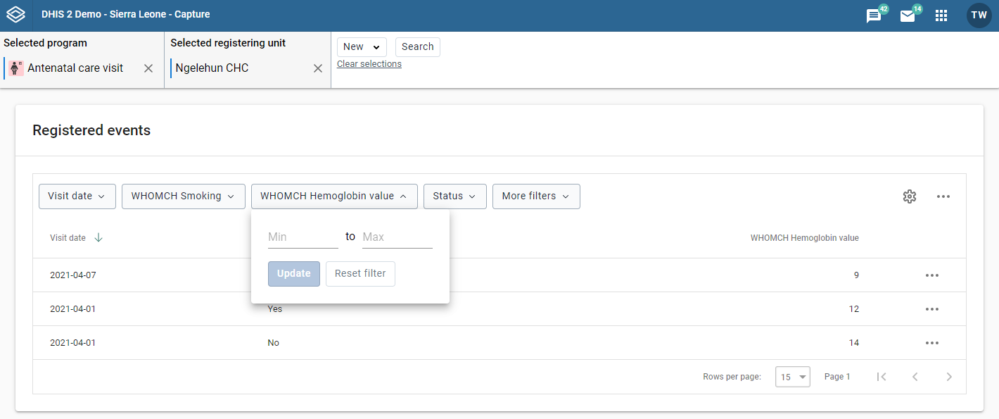

> **Note**
>
> Different data element types are fitered in different ways. A **Number** data element will for instance show a rang to filter on while a **Text** data element will ask you to enter a search query to filter on.

## Sort an event list { #capture_sort_event_list } 

1. Open the **eRecord** app.

2. Select an organisation unit.

3. Select a program.
    All events registered to the selected program show up in a list.

4. Click one of the column headers to sort the list on that data element in ascending order.

    A small upward arrow is displayed next to the column to show that the list is sorted in ascending order.

5. Click the column header again to sort the list on that data element in descending order.

    A small downward arrow is displayed next to the column to show that the list is sorted in descending order.

    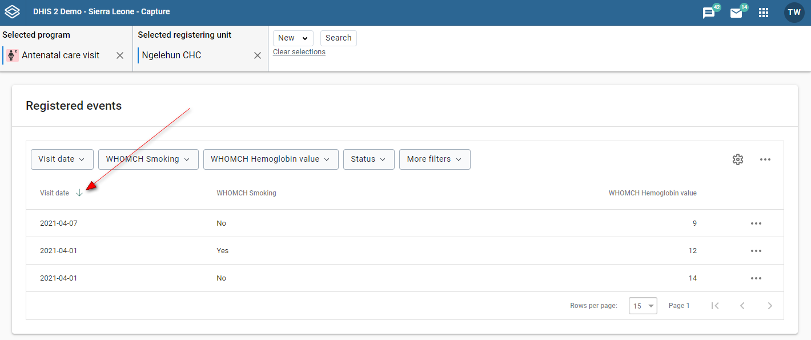

## Download an event list { #capture_download_event_list } 

1. Open the **eRecord** app.

2. Select an organisation unit.

3. Select a program.
    All events registered to the selected program show up in a list.

4. Click the **three dots** icon on the top right of the event list.

5. Click **Download data**.

6. Select the format you want to download.

    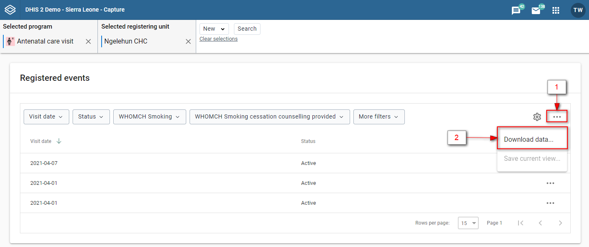

> **Note**
>
> You can download an event list in JSON or CSV formats.

## Predefined list views { #capture_views } 

You can set up your own views and save them for later use. The views can also be shared with others. A view consists of filters, column order and event sort order.

### Saving a new view { #capture_view_save } 

1. Select an organisation unit and a program.

2. Set filters using the filter buttons above the event list (described in detail [here](#capture_filter_event_list)).

    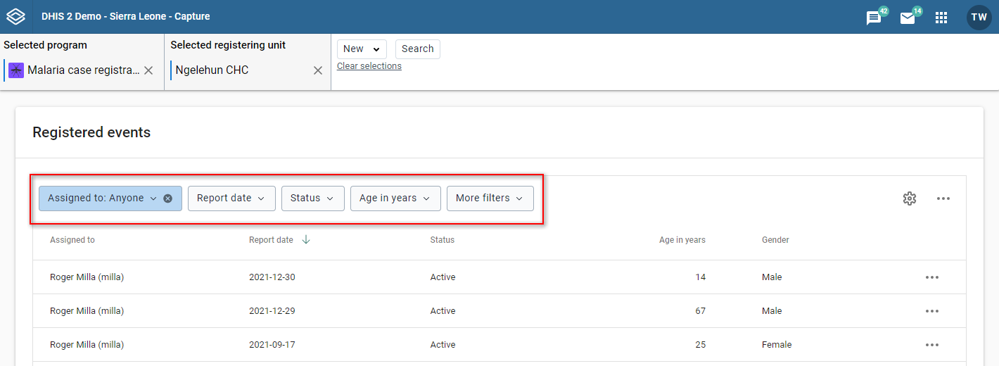

3. Set the column order by clicking the cog icon and then, in the pop-up, specify the layout according to your preference (how to modify the layout is described in detail [here](#capture_modify_event_list_layout)).

    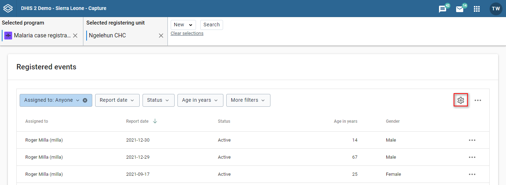

4. Sort the events by clicking on one of the column headers (described in detail [here](#capture_sort_event_list)).

    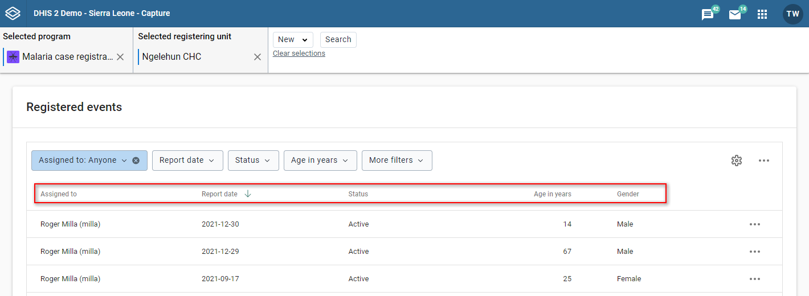

5. Open the more menu (three dots icon) to the right and then select "Save current view..."

    

6. Fill in a name for the view and click save.

    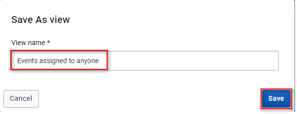

### Loading a view { #capture_view_load } 

1. Select an organisation unit and a program with a predefined view.

2. The views should be available above the event list itself. Click on a view to load it.

    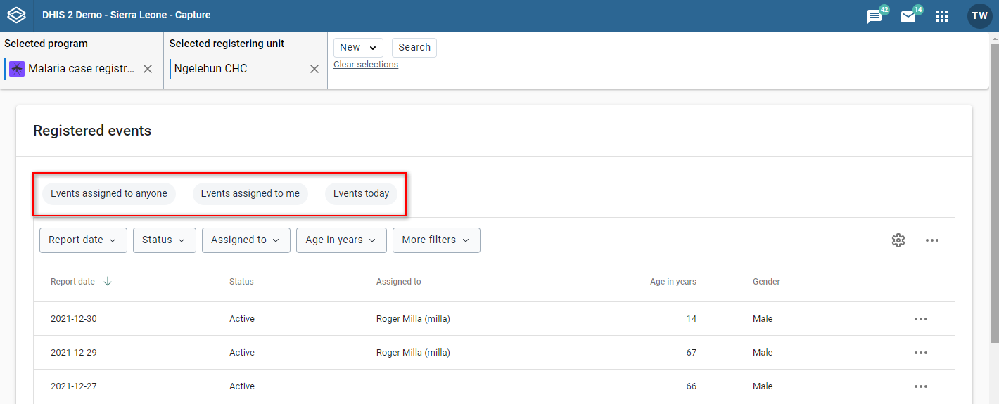

3. An example of a loaded view.

    

### Updating a view { #capture_view_update } 

1. Load the view you would like to update (see [loading a view](#capture_view_load)).

2. Make your changes to filters, column order and/or event sort order.

    > **Note**
    >
    > An asterisk(*) is appended to the view name when the view has unsaved changes.

3. Open the more menu (three dots icon) to the right and then select "Update view".

    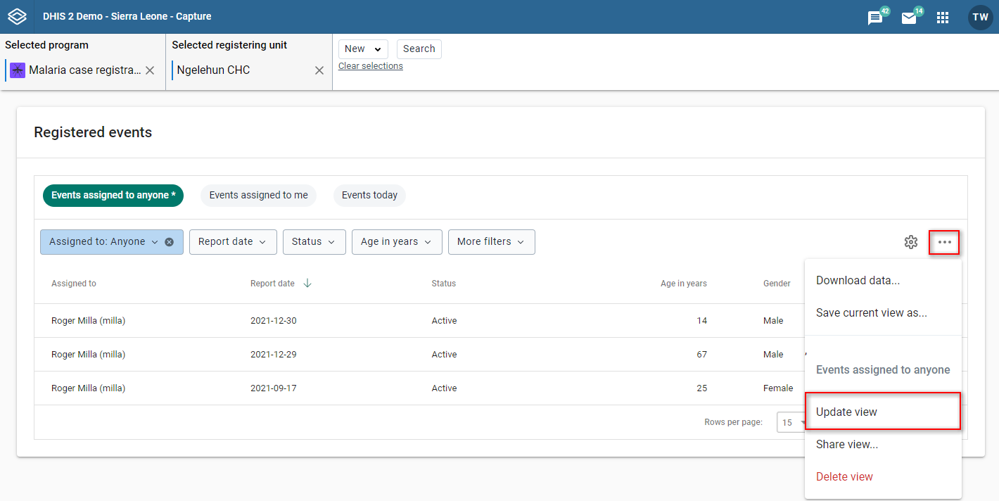

## Tracker programs { #capture_tracker_programs } 

The Capture app supports the workinglists in tracker programs, but when you open a tracked entity instance, you will be redirected to the enrollment dashboard in the Tracker Capture app.

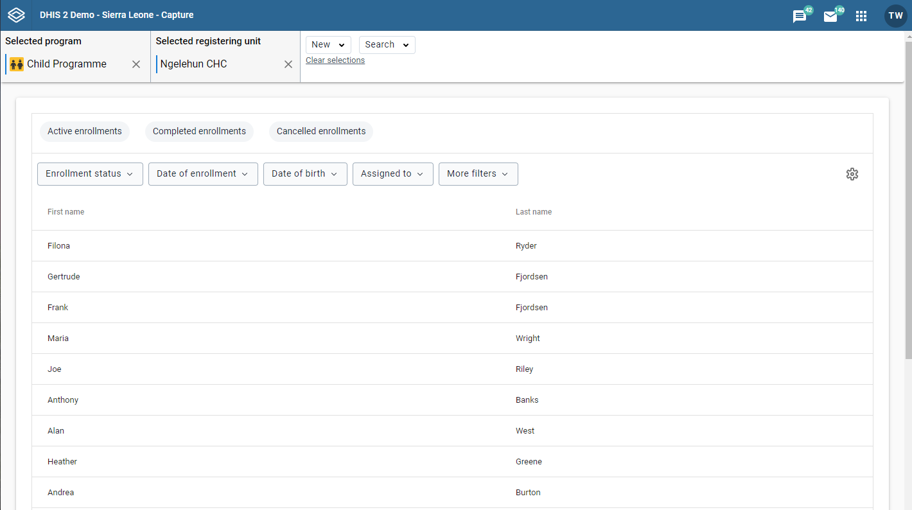

## Search for tracked entity instances

### In Program scope

1. Open the **eRecord** app.

2. Select a program.

    You will only see programs associated with the selected organisation unit and programs you have access to, and that are shared with your user group through data level sharing.

3. Click the Search button.

4. From the dropdown menu click the first option.

    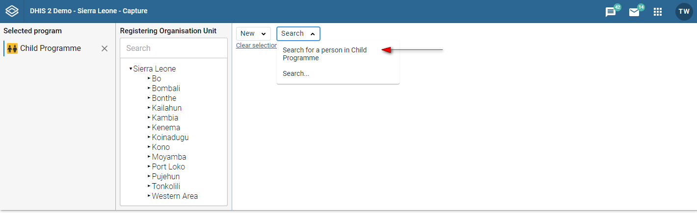

    These steps will take you to the search page. There, based on the configuration of your organisation, will see the different attributes you can search with. An example of how this looks is the following.

    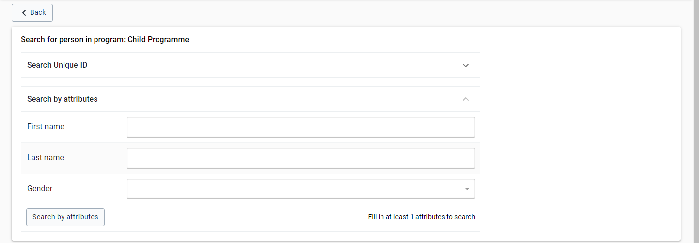

    To execute a search now:

1. Fill in the attributes you want to search with.

2. Click the **Search by attributes** button.

    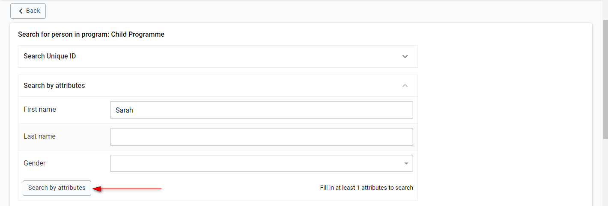

3. The results of the search will be displayed as follows.

    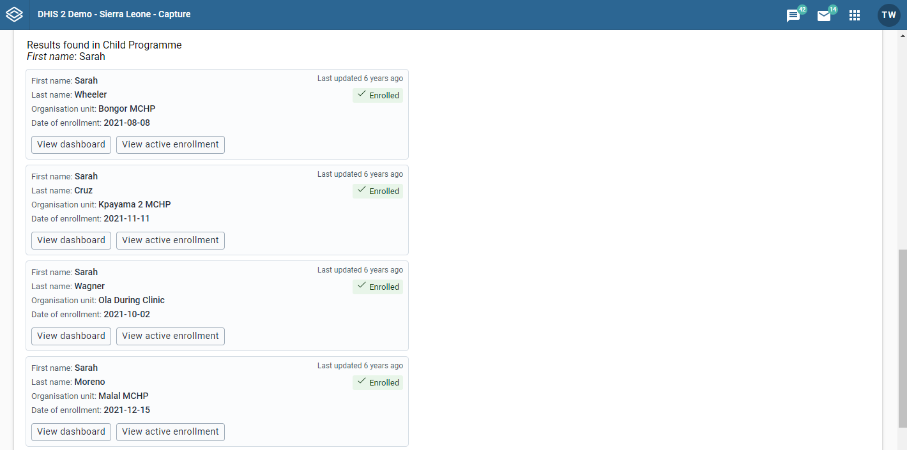

    In this list you can see the entries that match your search. For each entry you can have a total of three options.

    a. You can choose to view the dashboard for the **Tracked Entity Instance** by clicking the "View dashboard" button

    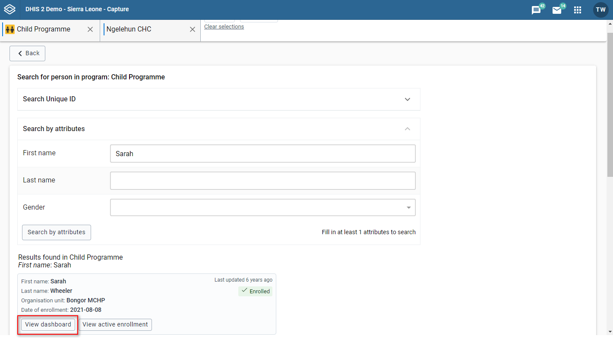

    b. You can view the the active enrollment of a **Tracked Entity Instance** by clicking the "View active enrollment" button

    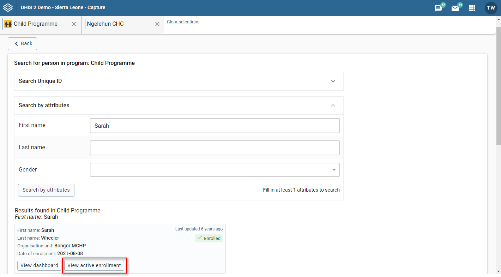

    c. You can re-enroll a **Tracked Entity Instance** to the current program you are searching within.

    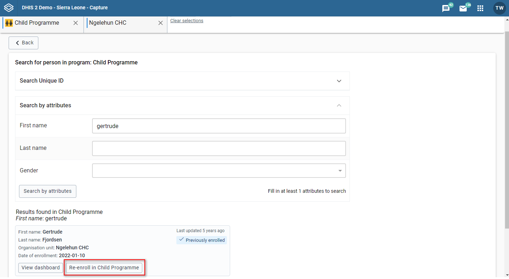

#### Fallback search

Execute a full search as described above. If the search you have made has results they will be displayed. However, the actual **Tracked Entity Instance** you are searching for may be within a different program. In that case, you may want to extend the search to other programs. This is known as a fallback search.

To execute a fallback search, simply press the button on the bottom saying "Search in all programs".
You will see the **Results in all programs** be appended below the search in the current program. These two modules are collapsible to save space. 

If the fallback can not be done, you will be presented with a modal to go **Back to search** so that you can change the search terms.

> **Note**
>
> The fallback search is only possible when searching within a Program.

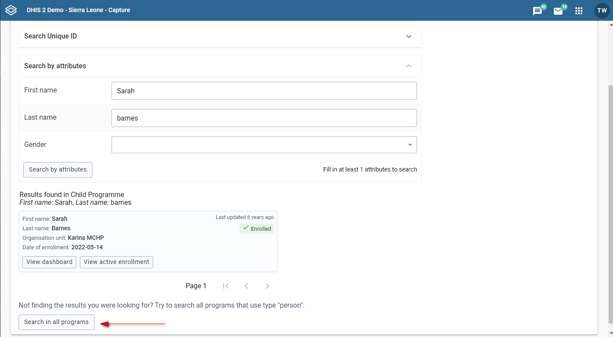

#### Create new **Tracked entity instance**

When none of the results match, you can create a new user by clicking **Create new** button on the bottom of the search page. 

Based on the search domain, you will be navigated to the registration of the selected **Tracked entity type**, with or without program enrollment preselected. 
The search terms that you typed in before will be prefilled in the registration form.

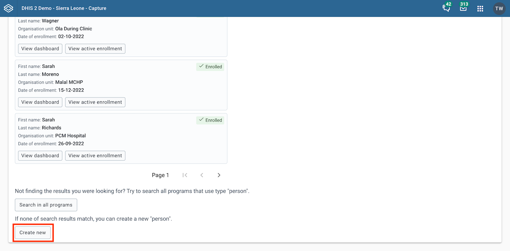

### In Tracked entity type scope

1. Open the **eRecord** app.

2. Click the **Search** button to open the search page.

3. Click on the drop down menu and select the type of entity you want to search for.

    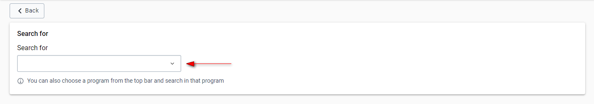

4. Make a selection from the list.

    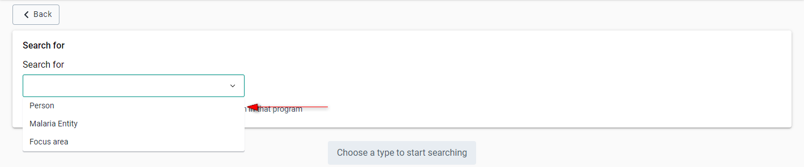

    Based on the configuration of your organisation you will see the different attributes you can search with. An example of how this looks is the following.

    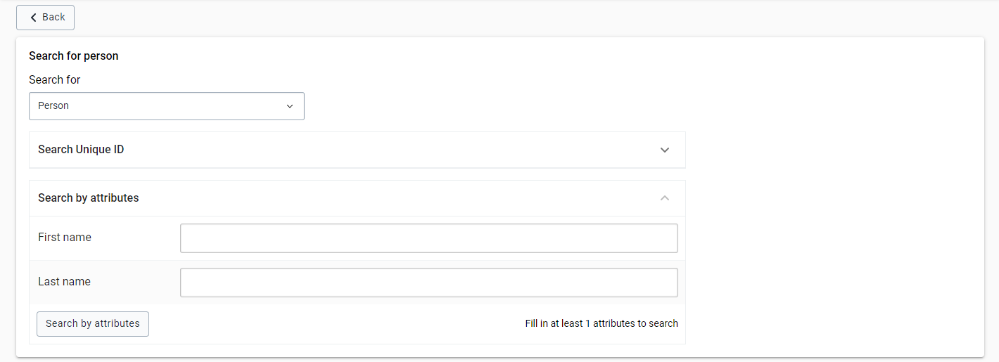

    To execute a search now:

1. Fill in the attributes you want to search with.

2. Click the Search by attributes button.

    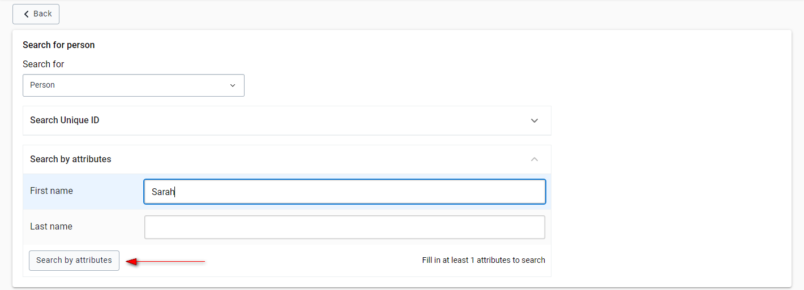

3. The results of the search will be displayed as follows.

    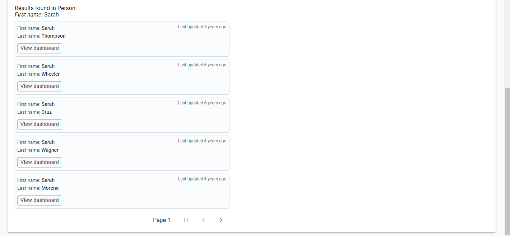

    In this list you can see the entries that match your search. For each entry you have the option to click the "View Dashboard" button to view the dashboard for the **Tracked Entity Instance**.

### Too many results functionality

The program or tracked entitiy type you are searching within may be configured with a limit on the number of results that are retrurned from a search. If your search results exceed this limit you will be shown a warning message like the one below.

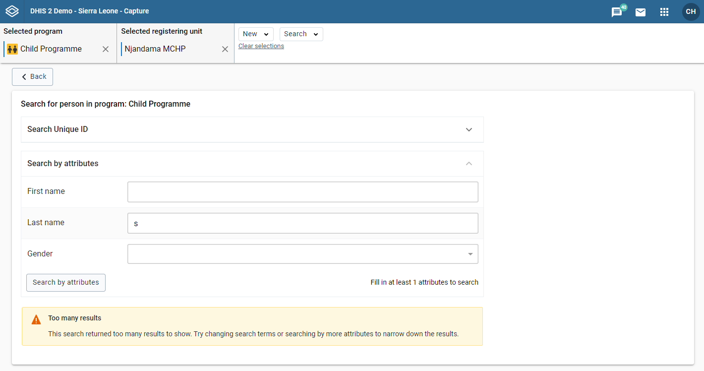

### Pagination

The results page shows up to five results at a time. You should try to use specific search criteria so that there are not too many matches. However, if there are more than five results, you can see the next results by using the **>** button at the end of the page.

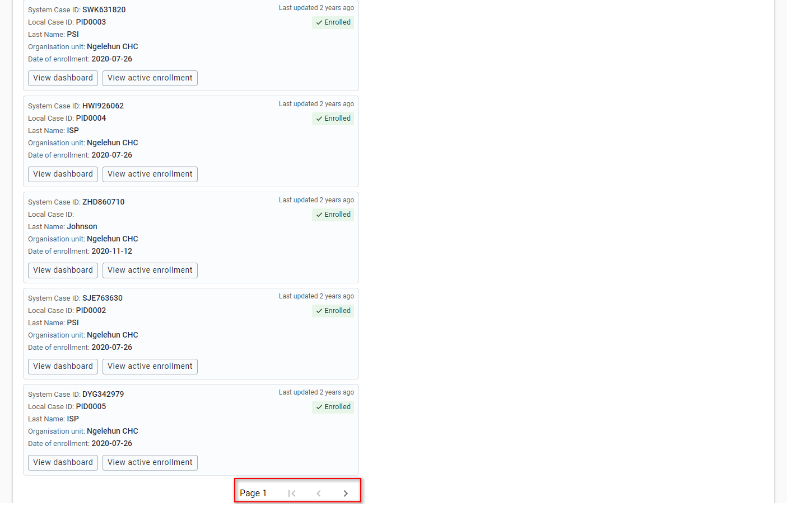

## List tracked entity instances enrolled in program

1. Open the **eRecord** app.

2. Select an organisation unit.

3. Select a tracker program with "Display front page list" set to true.

4. The program can have categories associated with it (implementing partner would be an example of such a category). If this is the case, fill them in.

### Custom TEI working list for programs with "Display front page list" set to false.

1. Open the **eRecord** app.

2. Select an organisation unit.

3. Select a tracker program with "Display front page list" set to false.

4. If the program has any custom working list you are able to click and load it.

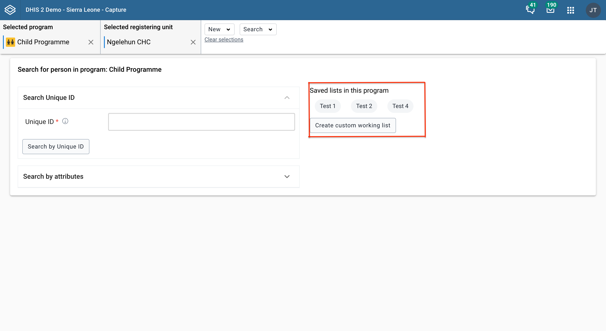

### Filter the list

Use the buttons above the list itself to filter it.

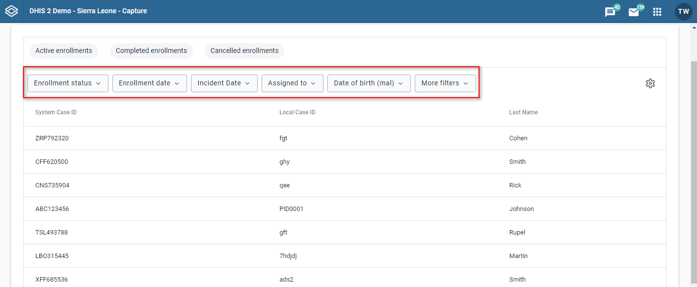

As an example, you could filter the list to show only tracked entity instances where you have been assigned an event: Click the "Assigned to" filter (1), select "Me" (2) and then "Apply" the changes (3).

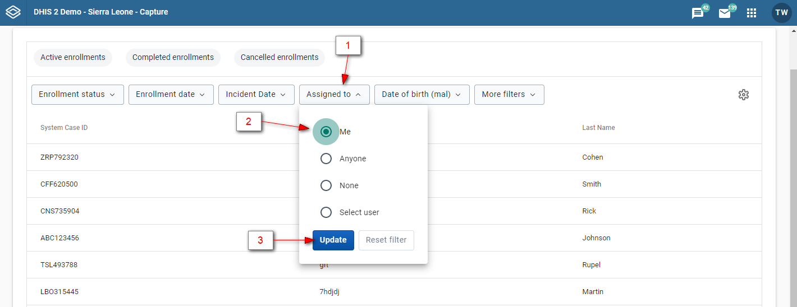

### Sort the list

Click one of the column headers to sort the list by that column. A small arrow is displayed next to the column header to indicate the current sort order. Click again to change between ascending and descending order.

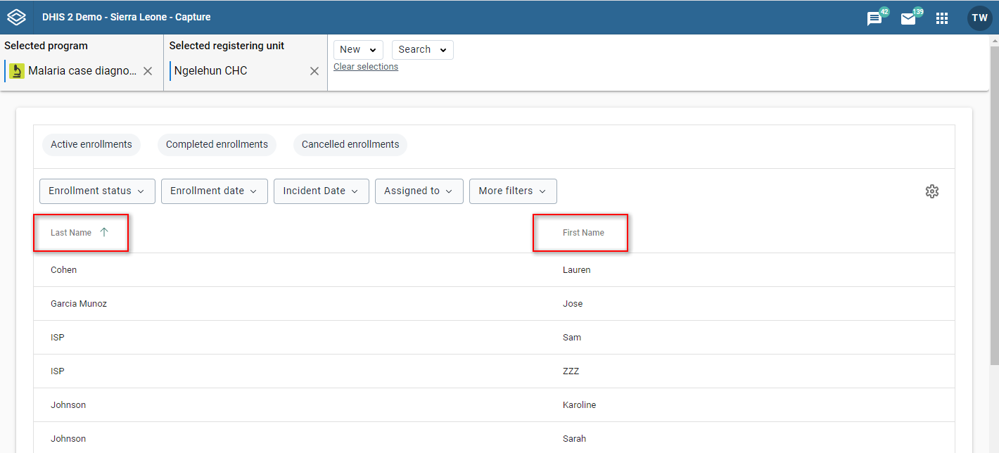

### Modify the list layout

You can select which columns to show in the list and also reorganize the order of the columns.

Click the **gear** icon in the top right corner of the list. Tick the checkboxes for the the columns you would like to display (1) and reorgainze the columns by dragging and dropping (2).

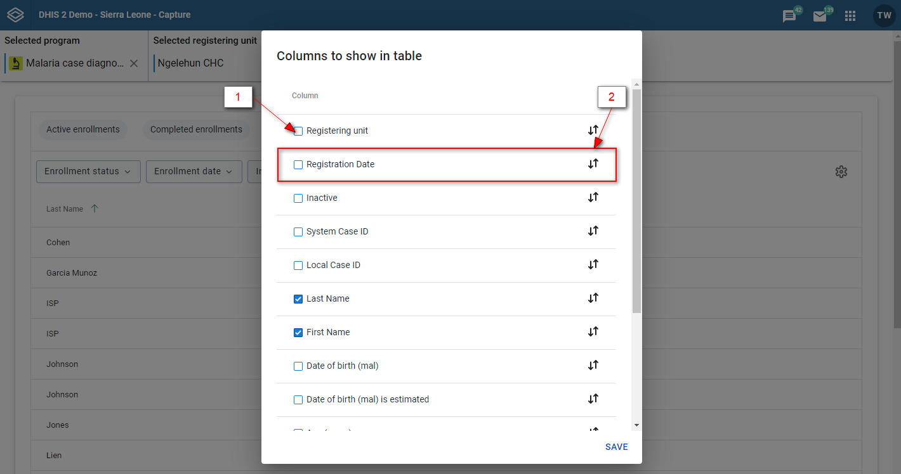

### Loading a predefined list view

You will find the predefined list views above the filters for the list. Click to load a view. 

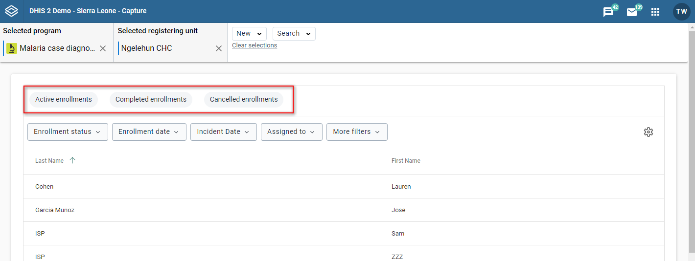

### Download the tracked entities list

1. Open the **eRecord** app.
2. Select an organisation unit.
3. Select a tracker program with "Display front page list" set to true.
4. Click the **three dots** icon on the top right of the tracked entities list.
5. Click **Download data**.
6. Select the format you want to download.
    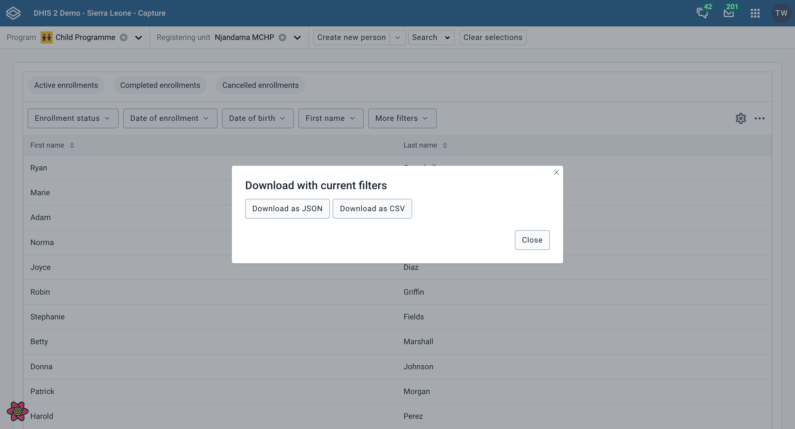
> **Note**
> You can download the tracked entities list in JSON or CSV formats.

## Tracker program stage working list

You can show data elements from a single stage in a working list. Select the "Program stage" option from the "More filters" dropdown, then choose a program stage.

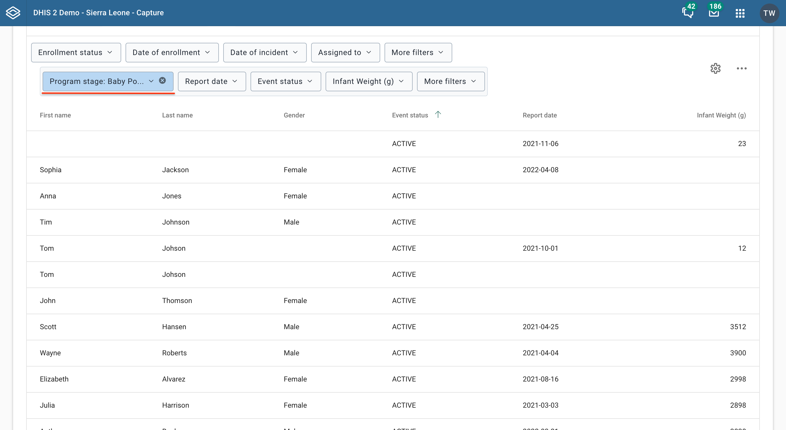

The tracker program stage list can be [filtered](#filter-the-list), [sorted](#sort-the-list), [modified](#modify-the-list-layout), [saved](#capture_view_save), [updated](#capture_view_update), [deleted](#capture_view_delete) and [shared](#capture_view_share) in the same way as other working lists.

## Implementer / administrator info { #implementer_info } 

### Metadata caching { #metadata_caching } 

For performance reasons the Capture app caches metadata in the client browser. When metadata is updated on the server the changes needs to be propagated to the clients that have already cached the metadata. Depending on the change, this is done in one of three ways:

1. If the change is bound to a program you will need to increase the program version for that particular program. For example, if you change the data elements in a program or a program rule, the version for the bound program needs be increased.

2. If the change is NOT bound to a program you will need to increase ANY program version for the change to be propagated to the clients. Examples here are changes to constants, organisation unit levels or organisation unit groups.

3. The exception to the two rules above is option sets. Option sets have their own version property, i.e. increasing the option set version should ensure the option set metadata are propagated to the clients.

## Enrollment dashboard

### Enabling the enrollment dashboard

#### Opt in

Enable the enrollment dashboard for a Tracker program for all the users. The dialog is visible for users with program write access. 

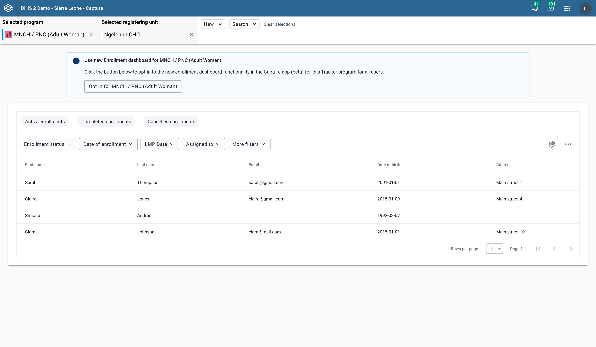

#### Opt out

Disable the enrollment dashboard for a Tracker program for all the users.

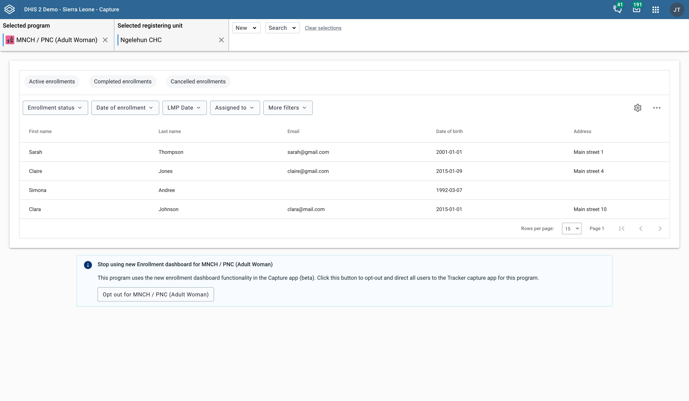

### Reaching the enrollment dashboard via url

You reach the enrollment dashboard either by typing in the address bar of your browser or using the user interface of the capture app.
In this section we are focusing on the first use-case, where you type or paste the url you want to access in the Address bar.

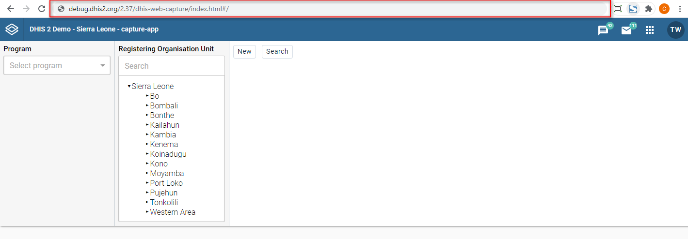

One way to reach the enrollment dashboard and view a specific tracked entity instance's enrollment is by using _only_ the enrollment id. For example the link .../dhis-web-capture/#/enrollment?enrollmentId=wBU0RAsYjKE will 
take you the dashboard for the enrollment with id `wBU0RAsYjKE`. 

The top of the dashboard defines your context. For example in the image below the context is as follows, the selected program is "Child Programme", the organisation unit is "Ngelehun CHC", the selected person is "Anna Jones" and the selected enrollment is "2017-11-16 11:38".

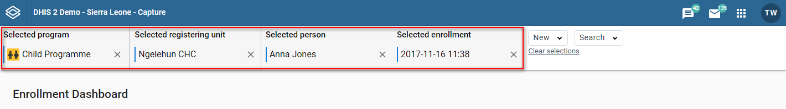

You can change your context by clicking the "x" button.

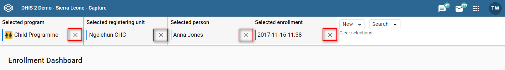

#### Deselecting the program

When you deselect the program you see the following

##### Selecting a program with enrollments

When program _and_ enrollment selections are empty, you first have to select a program. 
If the tracked entity instance (in this case "Anna Jones") has enrollments under the program you select you will see the following message.

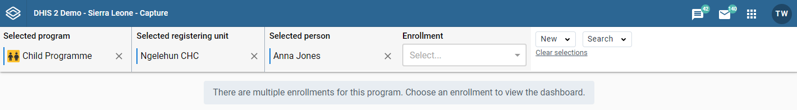

##### Selecting a program with zero enrollments

If the tracked entity instance (in this case "Anna Jenkins") does not have enrollments under the program you select you will see a message explaining that there are no enrollments for that program.
You will also be given the option to enroll "Anna Jenkins" in that program.

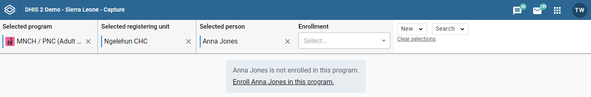

##### Selecting an event program 

When you select an event program you will see the following. (Remember event programs do not have enrollments in the system, only tracker programs do).

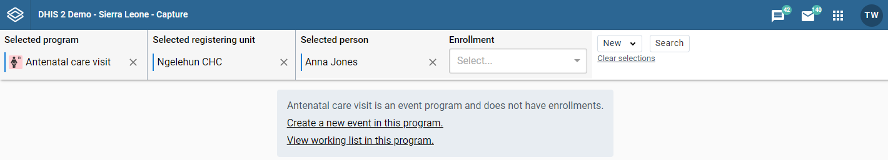

You will also be given the option to either create a new event for the selected program or view the working lists for the selected program.

##### Selecting a program with a different tracked entity type 

When your selected tracked entity type is a person, as in our example with Anna Jenkins, and you select a program that is not of type person but for example of a type Malaria case you will see the following.

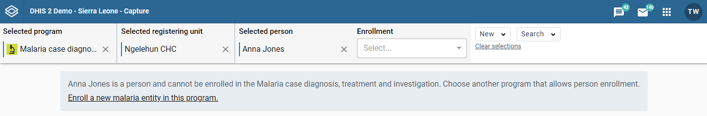

You are also given the option to enroll a tracked entity instance in the program you selected.

#### Deselecting the organisation unit

When you deselect the organisation unit you see the following


#### Deselecting the tracked entity instance

When you deselect the tracked entity instance, in this case "Anna Jones" you are taken to the working lists in that Tracker program.


#### Deselecting the enrollment

When you deselect the enrollment you see the following

###Quick actions

The quick actions widget offers shortcuts for frequently used actions for the current enrollment.


### Program stage list

Stages can be collapsed or expanded to reveal the events inside.


#### Collapsed stages


In the collapsed state, you can view the summary information about this stage including: 
- Icon
- Program stage name
- Program stage description (on hovering the information icon)
- Total number of events
- Last updated date 
Depending on the status of events, there can be additional information regarding: total number of overdue events or total number of scheduled events.

#### Expanded stages


When you expand the list, you will see the table contains the data of events in the stage. This includes mandatory columns: `Status`, `Report date` and `Organization unit`, the following columns depend on the data elements that have been selected as `Display in list`  of event.

Events are sorted with most recent on top and other columns are also sortable.


When clicking  **New {stage event name}** button, you will be redirected to the  **Add new event page** for this selected stage.


When clicking  **Go to full {stage event name}** button, you will be redirected to the  **Program stage list page** for this selected stage.


#### Expanded stages with more than 5 events 

In case there are more than 5 events in the list, only the first 5 are shown. You will be able to view the rest by clicking  **Show more**.


If you want to collapse events, you can use  **Reset list** button which will return the table back to the default sorting and initial 5 events.


### Enrollment widget

On the enrollment page you can see the enrollment widget


#### Enrollment actions

When you click on the enrollment actions button, a menu with all the available actions will open. You can:

- Change the enrollment status to Active, Canceled or Completed using the buttons in the menu.
- Mark or remove the enrollment for a follow-up.
- Transfer the enrollment to another organisation unit
- Delete the enrollment
- Add coordinates to the enrollment


There can only be one active enrollment at a time. If there are no active enrollments, there will be a button **Add new** to enroll the tracked entity instance in the program again.
If the program only allows one enrollment per tracked entity instance, the **Add new** button will be disabled with a tooltip saying `Only one enrollment per {TET} is allowed in this program`.


#### Transfer the enrollment to another organisation unit

In the enrollment actions, you could also choose to transfer the enrollment to another organisation unit. Click the transfer button and select the organisation unit you want to transfer the enrollment to.


#### Delete the enrollment

You can delete the enrollment by clicking the delete button and confirming the action in the modal. 


#### Complete the enrollment

You can complete the enrollment by clicking the complete button. When there are active events, you can choose to complete the enrollment along with the events from the confirmation modal.


### Enrollment note widget

The enrollment note widget displays notes and allows addition of notes, associated with the current enrollment. 


By clicking in the text field, you will be able to enter new text and see action buttons **Save note** and **Cancel**. Be aware that Enrollment notes are attributed to a user and cannot be deleted. 

### Relationship widget

The Relationships widget on the enrollment dashboard is used for viewing the record’s linked relationships to other records.
The number next to the title signifies the total number of relationships


For tracked entity instance relationships, the key attributes shown in the widget are the attributes that have been selected to be displayed on the relationship type page in Maintenance.

If no attributes are selected, it will just show a row per record with tracked entity type name and relationship creation date.

When clicking a tracked entity instance you should be taken to the Enrollment Dashboard. If the relationship type includes a program, you should be taken to the latest enrollment for that program. If no program is specified, you should still be sent to the enrollment dashboard, but without a program.

Click the **Add new** button to add a new relationship. Adding a new relationship opens a dialog where you can select the applicable relationship type.


Choose between linking to an existing tracked entity instance or creating a new one.


#### Existing tracked entity instance

Use the search form to find any existing record to link to.


#### New tracked entity instance

Use the form to create a new record and link.


### Tracked entity instance profile widget

On the enrollment dashboard, you can view the tracked entity instance profile widget. Inside the profile widget you can view the key attributes values. 


Click the **Edit** button to make changes to the tracked entity instance profile. Editing the profile opens a dialog where the profile attributes can be changed.


Click the **Delete ${tracked entity type}** button to delete the tracked entity. You can confirm the action from the dialog. Once confirmed, tracked entity and all its associated enrollment and events across all programs will be deleted. To delete a tracked entity that has any enrollments, the user needs the authority **Delete tracked entity instance and associated enrollments and events**.


### Feedback widget


On the enrollment dashboard, the feedback widget displays text and values that are triggered by certain conditions. 
If the current dashboard triggers some rules set up in the program, the text or values will be automatically displayed.

#### Empty state

If there isn't any feedback for the current dashboard, the widget shows a short _empty_ message.
If there aren't any program rules that could show feedback for the current dashboard then the widget is hidden.

### Indicator widget


On the enrollment dashboard, the indicator widget displays indicator text and values output related to the current dashboard.
The indicators will be sorted alphabetically.

#### Empty state

If there aren't any related indicators or indicator output for the current dashboard, the widget shows a short _empty_ message.
If the current dashboard can't show any indicator output (because it has no related indicators) then the widget is hidden.

#### Legends

Some indicator values show a colored circle next to the value. 
The colored circle shows the related legend color for that indicator value. 
Colored legend circles are only shown for indicator values that have them set up.

### Warning widget


On the enrollment dashboard, the warning widget displays warnings related to the current dashboard. The widget shows warnings that are not associated with any specific data item.
If there aren't any warnings to show for the current dashboard then the widget is hidden.

### Error Widget


On the enrollment dashboard, the errors widget displays errors related to the current dashboard. The widget shows errors that are not associated with any specific data item.
If there aren't any errors to show for the current dashboard then the widget is hidden.

## Enrollment event view and edit page

### Navigation 

You can reach the enrollment event edit page is by clicking any event in the Program stage list from the Enrollment Overview page.

### Top bar context 

At the top of the page you can see various information related to the current context. You can see the program, the organization unit, the tracked entity, the enrollment date, the stage and the enrollment event date.

To go to Enrollment Overview page you can:
- click the "Back to all stages and events" button.
- deselect the stage from the top bar.
- deselect the event from the top bar.


### View/Edit event form 

This is the form where you can see and edit the enrollment event details.

#### Form header 

In the view/edit event form you can see the stage name and icon.


### Top bar context  

At the top of the page you can see different informations related with the current context. You can see the program, the organization unit, the tracked entity, the enrollment date, the stage. 

To go to Enrollment Overview page you can: 
- deselect the stage from the top bar. 
- deselect the event from the top bar. 

 

### Scheduled date in edit event form
If an event has the status Scheduled or Overdue, you will be able to see the **Report** and **Schedule** tab. 


In the **Report** tab, the scheduled date field will still be shown, but will be greyed out, and there will be an icon next to it with a tooltip saying “Go to **Schedule** tab to reschedule this event”.

In the **Schedule** tab, the similar information about scheduling an event as in New event workspace will be shown. You will be able to edit the schedule date and save the change by clicking **Schedule** button.


If an active event has a scheduled date before becoming active or a completed event has scheduled date, this date should still be shown in the workspace. 
It’ll be locked with an icon next to it and a tooltip saying “Scheduled date cannot be changed for active/completed events”. 

#### Scheduled date with Hide due date enabled
If the flag “Hide due date” in the Maintenance configuration is enabled, scheduled date will not be shown in the form. 

However, you can still schedule an event, but it automatically chooses the date based on "Scheduled days from start" that has been configured in Maintenance, and this can not be changed. 
In the **Schedule** tab, there will be “Schedule info” saying “Scheduled automatically for xx/xx/xx”, and the user can click  **Schedule** button.

### Ask user to complete program when stage is complete
If this flag has been enabled for the stage in Stage details in Maintenance, a modal will show up after the user checks the **Complete** event checkbox and clicks save.


#### View mode

When the form is in the view mode the title of the page will appear as: `Enrollment: View Event`. You can see in the page all the information related to the event. Click the `Edit event` button to switch to the edit mode. 
This mode is bypassed for events that are scheduled.

#### Edit mode

When the form is in the edit mode the title of the page will appear as: `Enrollment: Edit Event`. You can modify the event and click the `Save` button. Click the `Cancel` button to switch to the view mode without saving the changes.
Scheduled events are are the exception and they are opened in edit mode directly, without the user having to click `Edit event`. Click the `Cancel` button to go back to the enrollment dashboard page without saving the changes.


In this form you can also delete the event by clicking `Delete` button, a modal will appear to confirm if you want to delete this event. You will then be navigated back to Enrollment dashboard page.


#### Widgets in View/Edit event page

The widgets seen in the right-hand column will display and function the same way as mentioned in the [enrollment dashboard](#enrollment-dashboard).

##### Widget assignee
1. In View/Edit enrollment event page

2. In the right column you will find the assignee widget.

    

3. Click the **Edit** button, or the **Assign** button if the event is not currently assigned to anyone.

    

    

4. Search for and select the user you would like to reassign the event to. Click the **Save** button.


## Enrollment event new page

You can reach this page add event page by clicking in the **New {stage event name}** button in the overview page. 
In this page you can switch between different tabs: **Report** to add new event, **Schedule** to schedule an event and **Refer** to refer event.
If you have unsaved changes in one tab and switch to another tab, there will be a warning displayed.

### New event widget form

This is the form where you can modify the event details before saving. In the header you can see the stage name and icon.


### New event page without a stage

If you enter the new event page with no stage selected, a list of available stages will be displayed.
Select the stage you want to add a new event in by clicking the associated button.
To navigate back to the enrollment overview, click the **Cancel without saving**-button


### Ask user to complete program when stage is complete
If this flag has been enabled for the stage in Stage details in Maintenance, a modal will show up after the user clicks the **Complete** button.


### Ask user to create new event when stage is complete
If this flag has been enabled for the stage in Stage details in Maintenance, a modal will show up after the user clicks the **Complete** button or checks the **Complete** event checkbox and clicks save. The user can choose the button **Yes, create new event** to navigate to the New Event page or **No, cancel** to navigate back to the enrollment dashboard. If there is only one possible stage available, the user will be taken directly to the New event workspace for that stage.

### Assigning user to new events
When reporting or scheduling an event, you can assign a user to it. This feature must be enabled per program stage in a tracker program by clicking the "Allow user assignment of events" check box.

You will find the assignee section near the bottom of the data entry page. Search for and select the user you would like to assign the event to. The assignee will be preserved when you save the event.


### Schedule event widget form
Instead of reporting an event the user can select to schedule an event for later. The form will open with a suggested scheduled date. This date is determined by a set of rules as explained below.

The suggested date for the first event of a program stage in an enrollment is always based on the enrollment date or the incident date (depending on the program configuration). The program stage configuration setting "scheduled days from start" will be added to the base date to cumpute the suggested date.

#### 1. **Default next scheduled date**
If a program stage has a default next scheduled date configured, the suggested date is the most recent next scheduled date. Below is an example of how this can work.
>
1. A data element with value type date needs to be created and assigned to the particular program stage with access to future dates. The name of the data element could for example be: Next suggested follow up date. The program stage is configured to use the data element as default when scheduling a new event by assigning the data element to default next scheduled date.


2. A program rule based on the data entered in the program stage, will determine how many days until the next suggested follow up will be. For example: A program rule with the following condition: #{penta_dose} == '1' (The program rule will trigger when the TEI has received Penta Dose 1), Assign value to the data element: next suggested follow up date with expression: d2:addDays(V{event_date}, '30') **The number suggest how many days from event date the next scheduled event should be.** 

3. Open the Capture app and create a TEI. As long as Penta Dose has value Dose 1, the suggested next scheduled event is 30 days forward from event date. When scheduling a new event, the system will pick up from the data element as long it has value.


User can also find more information about how many events that scheduled on the same selected date or the interval of selected date and the suggested date from the information box.

Below the schedule date entry, user can choose to add a note to the scheduled event.

After clicking **Schedule** button, user will be navigated back to enrollment overview page.

#### 2. **Standard interval days** 

1. If the program stage has standard interval days configured, the suggested date is calculated by the most recent event date plus the standard interval days value. 


2. If the program stage do not have a default next scheduled date configured, the system will use the standard interval days to calculate the next scheduled event date. 


#### 3. **If no value is found on either, the suggested date will be defined by enrollment date and incident date.** 

1. In case the option **Generate events based on enrollment date** is checked in the Maintenance app, the next suggested event date is calculated by the enrollment date plus the value of scheduled days from start. 


2. In case the option **Show incident date** is checked, the next suggested event date is calculated by the incident date plus the value of scheduled days from start.


## Program stage event list 

You can reach the program stage event list by clicking **Go to full {stage event name}** button in the overview page.

### Stage Event list 

In this view you can see all events in a stage 

#### Stage Event list header

In the header, you can see the stage name and icon 


## Attribute option combo for Tracker

You can add segregation to your Tracker event data using attribute option combos. To get started, add a category combination to your Tracker program configuration.

The attribute option combo selector will be displayed when you are adding or changing/viewing Tracker events. Additionally, the selector will be displayed when enrolling if events are being auto-generated as part of the enrollment process.

Example from new Tracker event:

